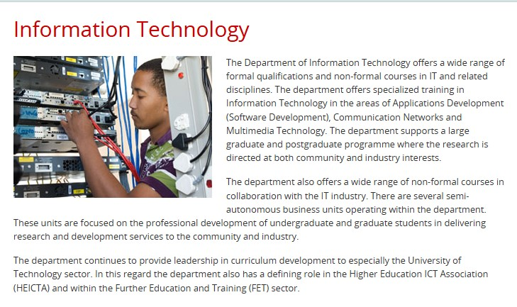

## Career-Planning-Development

> Growing up I always knew what I wanted to do which was in IT, but I was unsure that was when I applied to study at Cput. I did my research, weighed my strengths vs weaknesses and decided with the guide of a career councellor at UWC conducting a career test that this is indeed what I want to do. Although this happened many years ago I do not have any proof, but what I do have is my application to the courses offered namely Diploma in App Dev & Higher Certificate in ICT. I started with the HC in ICT which lead to my progress to Communication Networks. While at the time writing applications with javascript was interesting, I found exploring how we communicate worldwide fascinating and the tools we use to make it possible sparked my interest. 

I applied to the program and I was accepted at CPUT

![]
